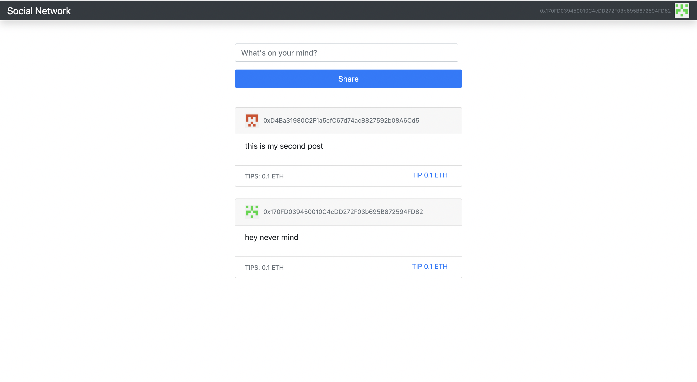

# Blog social-network

- BlockChain social network with smart contracts
- People can create they own avatars base on etherium address
- Able to share their status address on social network post
- Other users can tips them with crypto currency and the best post on the network rise to the top

# Project Results

# Getting Started

### Dependencies

- please install all the dependencies using npm install

### Installing

- clone this repository by using git clone https://github.com/judinilson/social-network.git
- then cd/social-network folder then install the dependencies

### Executing program

- To run it use the following command
- npm start
